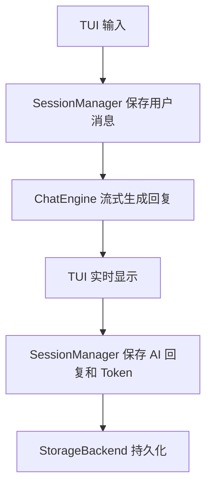

# 架构说明

## 分层设计

项目采用五层结构：

| 层级 | 目录 | 职责 |
|---|---|---|
| UI 实现层 | `src/ui/tui` | 命令行菜单、输入输出、对话展示 |
| 接口定义层 | `src/interface` | 定义 TUI/WebUI 共同遵守的协议 |
| 业务层 | `src/core` | 用户、预设、会话、对话引擎、配置管理 |
| 存储层 | `src/storage` | 可插拔存储后端与统一接口 |
| 数据模型层 | `src/models` | User、Session、Message、Preset 等实体 |

## 核心流程



## 存储后端

`StorageBackend` 是业务层唯一依赖的存储接口。当前实现：

- `SQLiteBackend`：默认后端，适合本地开发。
- `FileBackend`：JSON 文件后端，适合教学观察数据。
- `MySQLBackend`：保留 MySQL 配置入口，目前使用本地模拟，便于无数据库环境完成流程验证。

## 多环境配置

配置加载规则：

```text
最终配置 = config.yaml + config.{APP_ENV}.yaml
```

敏感信息加载规则：

```text
.env + .env.{APP_ENV}
```

`dev` 默认使用 SQLite 开发库；`test` 使用独立测试路径；`prod` 默认切换到 MySQL 配置入口。

## 扩展点

- WebUI：实现 `AbstractUI` 即可接入业务层。
- 多模型并行对比：`FutureWebUIProtocol.compare_models` 已预留接口。
- 图文上传：`accept_multimodal_input` 预留多模态入口。
- Tool Calling：`call_tool` 预留工具调用入口。
